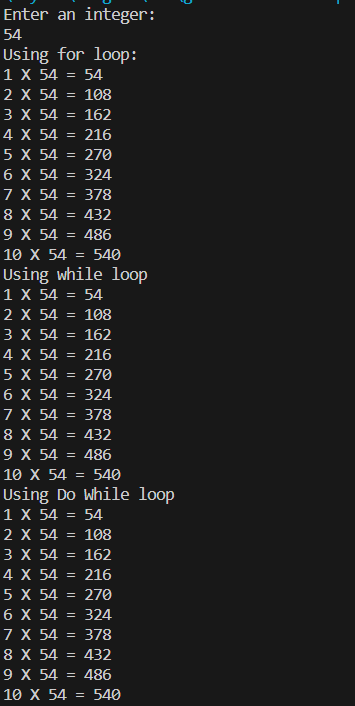

# Loops
A code explaining the basics of Loops in cpp programming language
## Aim
To understand Loops and different types of loops in cpp
## Theory
Loops are blocks of statement that repeats itself if certain conditon are met. Loops are used to repeat statememts without writing them repeatedly.
Some common Loops that are used are:
- For loops:
This is used when we know how many times the loops will repeat.
- While loops: 
This is used when we dont know know how many times the loop will repeat but until certain condition are met.
## Outcome of the code
Using loops to print the Multiplication (upto 10) table of an integer that is inputted by the user.
## Algorithm
1. Start
2. Print'Enter an integer'
3. Take an integer input
4. Print 'Using for loop'
5. Initializing an integer ('i') with with value '0' and incrementing it to 9, meaning the loop runs 10 times. **For** each value of the integer 'i+1', multiply the integer input.
6. Print the Product in the form "(i) X (integer input) = (product)"
7. Print 'Using while loop'
8. Initialize an integer (wvar) with 0 and increment it till it is equal to 9 (wvar<10), **while** 'wxar' is not equal to 10, Multpily 'wvar+1' with the integer input
9. Print the Product in the form "(wvar) X (integer input) = (product)"
10. Print 'Using do while loop'
11. Initialize an integer (dwvar) with 0 and increment it till it is equal to 9 (wvar<10), **while** 'wxar' is not equal to 10, **do** 'wvar+1'*the integer input
12. Print the Product in the form "(dwvar) X (integer input) = (product)"
13. End
## Explainantion
For loops execute a known number of times and we multipy and print the incrementing number with the integer input. 
While loops execute an uknown number unit a certain contion is not met. We initialze a variable and until that variable is smaller than 10, we run the ropom and increment the number. If we dont increment the number, the loop will run with the same number forever.Then we multipy and print the incrementing number with the integer input. 
Do While are essentially same as while loops with a different Syntax.

## Output Screenshot
#### We put the input integer as 54 and see the output as an example

